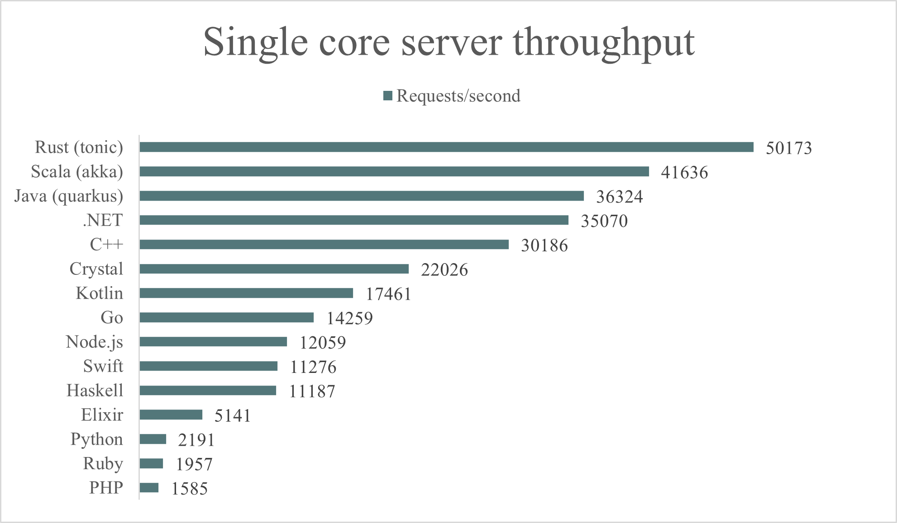
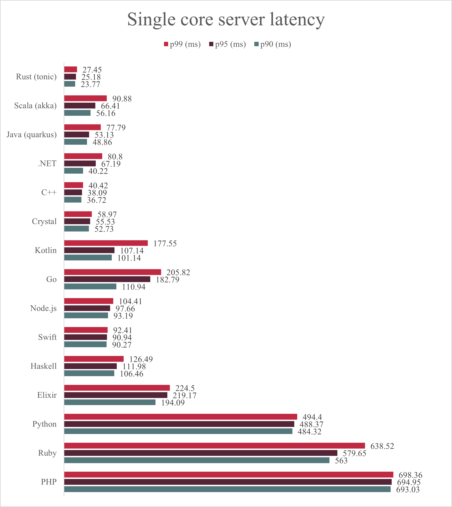
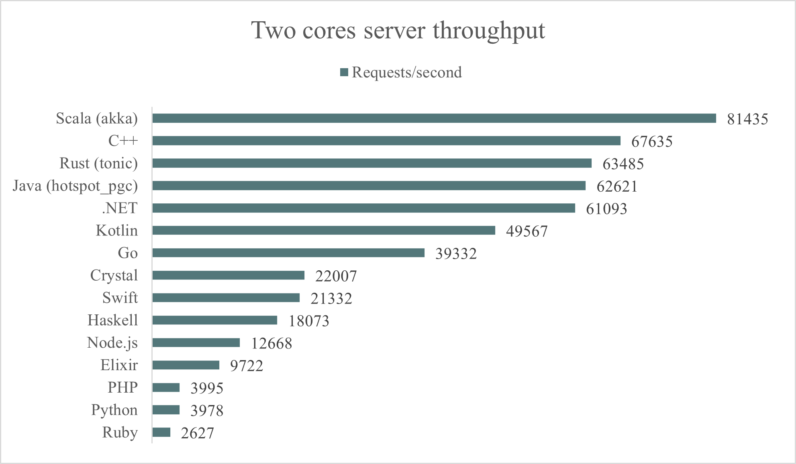
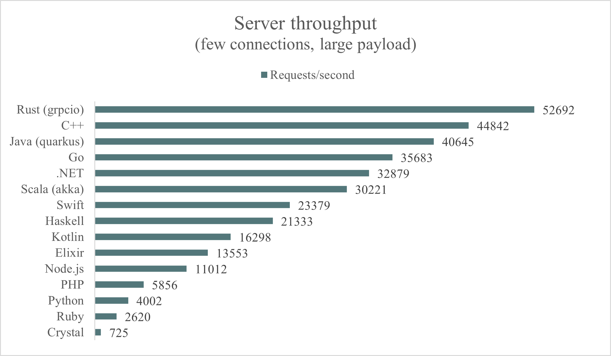
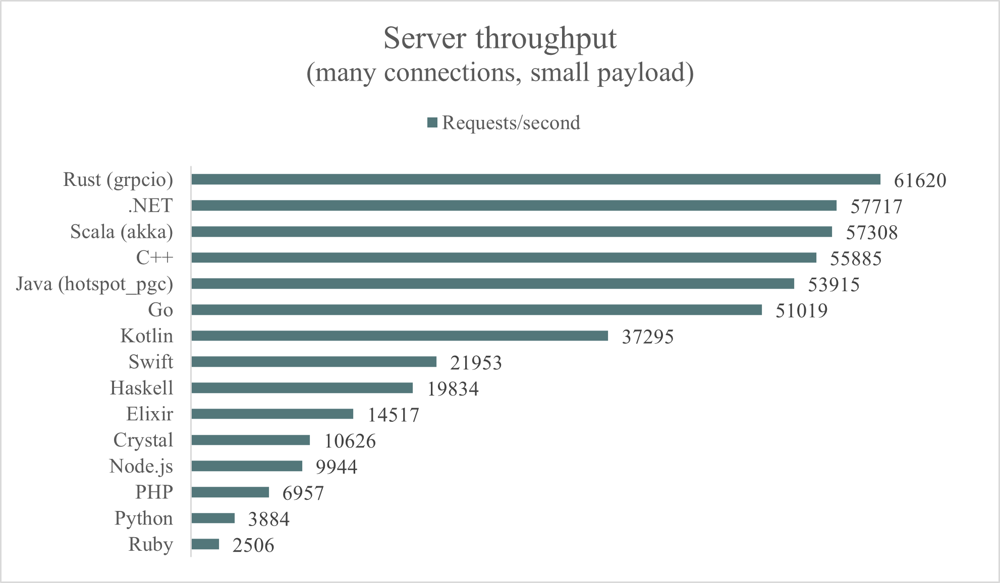

# Grpc

Information about Grpc.

## Tech stack

Grpc uses ```HTTP/2``` as it's communication protocol
and ```Protobuf``` as it's communication contract.

The content of a Grpc message is binary, meaning it's fast.
It hides remoting complexity.

### HTTP/2

Because it uses HTTP/2 it can use multiplexing,
meaning multiple calls via a single TCP connection is possible.
It also decreases the chance of head-line-blocking.

### Bandwidth

Grpc also has low network usage beacuse HTTP/2 does
framing and header compression.
And, the Protobuf message is serialized into binary.

## Setting up communication

In order for the services to communicate with each other,
they must reference and implement the same Protobuf files.

## Benchmarking

**Hardware**.

All tests were run on the following physical machine:

- Processor: Intel Xeon CPU E5-1650 v3 @ 3.50GHz
- Memory: 32GB, DDR4 2400 MHz
- Operating system: Ubuntu 18.04.5 LTS (GNU/Linux 4.15.0-112-generic x86_64)

**Workload**.

We ran two tests to benchmark the server implementations using one and two CPU cores.
Aside from the server's CPU, the benchmark's configuration is always the following:

- Benchmark duration: 120s
- Benchmark warmup: 30s
- Server RAM: 512MB
- Client connections: 50
- Client concurrency: 1000
- Client CPUs: 9
- Request payload: 100B








### Alternative workload results

- Warmup (30s) and duration (60s)
- 3 server CPU cores
- 250 client connections instead of 50
- A concurrency value of 500 instead of 1000
- Payload size remains 100B





## Summary

Grpc has support for browsers and web assembly.

Grpc is also a great choice for inter-process communication.
It can use Unix-to-Main sockets and Named-Pipes. **You could do ICP before,
but it was limited to TCP, now it support UDP and Name-Pipes**.
